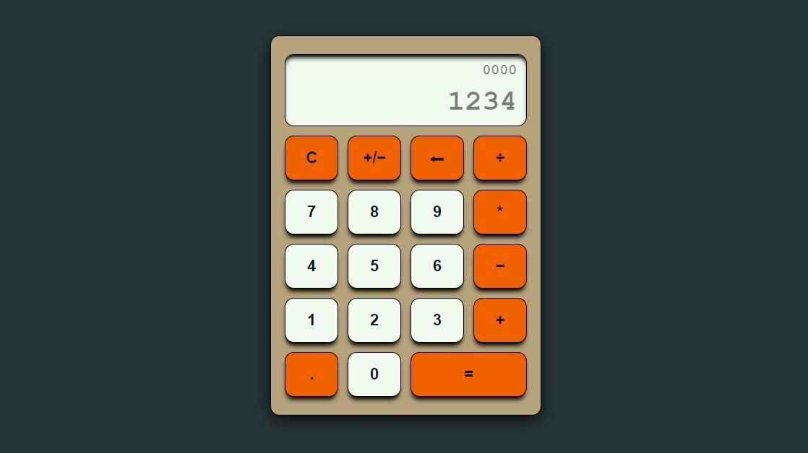

A calculator made entirely in Javascript, for the final project of [@The Odin Project](https://www.theodinproject.com)'s Fundamentals Course.

You can check out the [live preview here](https://marcodallagatta.github.io/javascript-calculator/).
